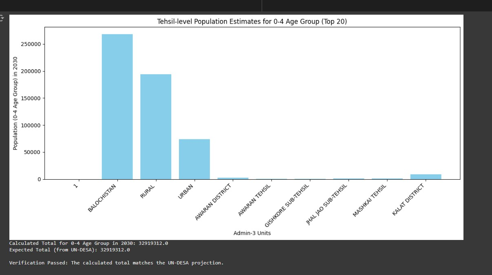
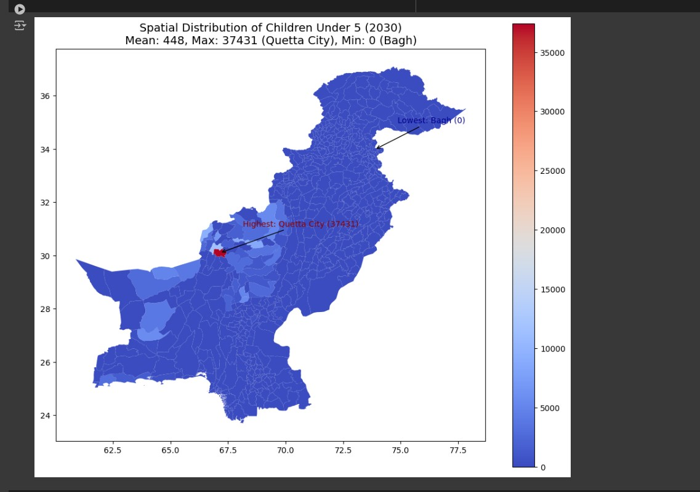
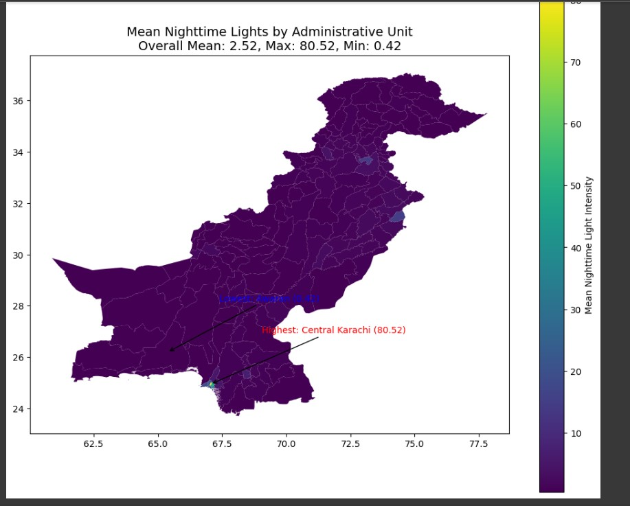
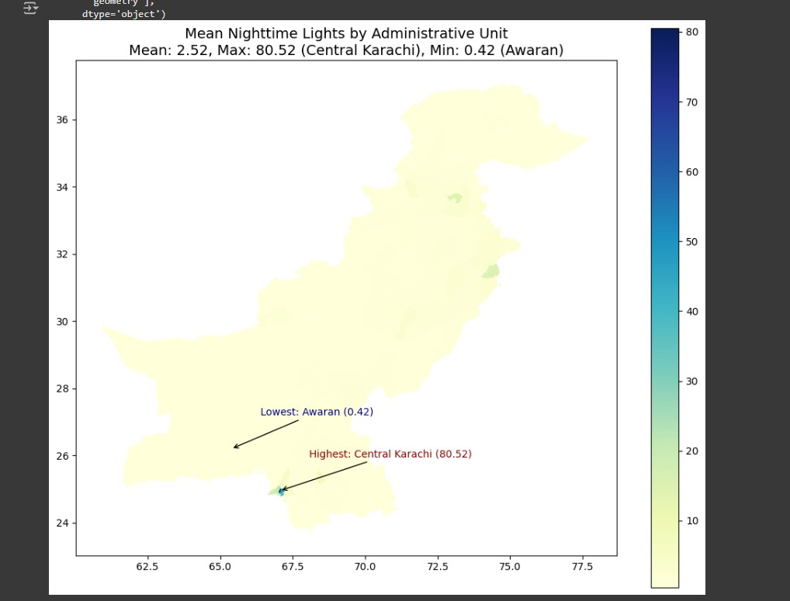
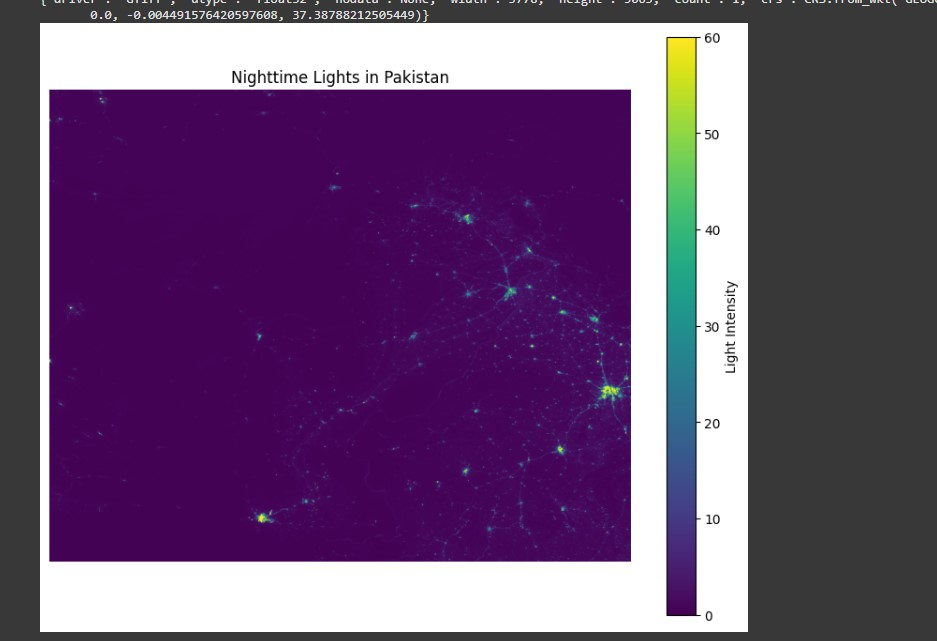

 **Spatial Analysis of Population and Nighttime Lights in Pakistan**
---

## **1. Project Overview**
This project focuses on analyzing population distribution, particularly children aged 0-4, and their spatial patterns across Pakistan. Additionally, it examines infrastructure development through nighttime light intensity data. The analysis integrates multiple datasets to provide insights into:

- Population distribution and projections for 2030.
- Mapping children under 5 years old.
- Infrastructure assessment using nighttime light intensity.

Key datasets include:
- **Pakistan 2017 Census Data**.
- **UN-DESA Population Projections**.
- **OCHA Shapefiles for Administrative Boundaries**.
- **Google Earth Engine VIIRS Nighttime Lights Data**.

---

## **2. File Structure**
The project is organized into the following directories:

### **/python/**
- Contains Jupyter Notebook scripts for data cleaning and analysis.
  - `Cleaning.ipynb`: Processes raw data and performs geospatial analysis.

### **/DataSets/**
- Includes raw datasets required for processing (*not shared in the repository due to size and licensing constraints*).

### **/Cleaned_data/**
- Cleaned and processed datasets for intermediate and final analyses, including:
  - `all_tehsil_cleaned.csv`: Cleaned 2017 Census data.
  - `all_tehsil_2030.csv`: Projected population for 2030.
  - `tehsil_children_0_4_2030.csv`: Children under 5 population for 2030.

### **/Processed_Spatial_Data/**
- Final geospatial outputs:
  - `final_spatial_distribution.geojson`: Spatial data for children under 5.
  - `Nighttime_Lights_Pakistan.tif`: VIIRS Nighttime Lights raster data.

### **/Shapefiles/**
- Administrative boundaries of Pakistan in shapefile format (Admin Levels 0, 1, 2, and 3).

---

## **3. Data Sources**
The following datasets were used:

- **Pakistan 2017 Census Data**: Base population data.
- **UN-DESA Population Projections**: Growth rates for projecting future populations.
- **OCHA Shapefiles**: Administrative boundaries of Pakistan.
- **VIIRS Nighttime Lights Data**: Nighttime light intensity, accessed via Google Earth Engine.

### *Access Instructions for External Data:*
1. **Pakistan 2017 Census Data**:[Pakistan 2017 Census Data](https://population.un.org/wpp/)
2. **UN-DESA**: [UN-DESA Population Projections](https://population.un.org/wpp/downloads)
3. **OCHA Shapefiles**: [Humanitarian Data Exchange](https://data.humdata.org/dataset/cod-ab-pak)
4. **Nighttime Lights**: Accessed via [Google Earth Engine](https://developers.google.com/earth-engine/datasets/catalog/NOAA_VIIRS_DNB_ANNUAL_V22).

---

## **4. Tools and Technologies**
- **Python** (Key Libraries: `pandas`, `geopandas`, `rasterstats`, `matplotlib`)
- **Google Colab**: For cloud-based code execution.
- **Google Earth Engine**: For VIIRS Nighttime Lights data extraction.
- **QGIS**: Optional for geospatial data validation and visualization.

---

## **5. Setup Instructions**
1. **Clone the Repository**:
   ```bash
   git clone https://github.com/Elder-Fang/population_analysis.git
   cd population_analysis
   ```

2. **Install Required Python Libraries**:
   ```bash
   pip install pandas geopandas rasterstats matplotlib
   ```

3. **Adjust File Paths**:
   Update file paths in scripts to match your directory structure. Example:
   ```python
   file_path_kp = "/path/to/DataSets/sindh_tehsil.xlsx"
   cleaned_file_path_kp = "/path/to/Cleaned_data/sindh_tehsil.csv"
   ```

4. **Download External Data**:
   Refer to the "Data Sources" section for external data requirements.

5. **Run the Notebook**:
   Open `Cleaning.ipynb` in Google Colab or a local Jupyter environment and execute the cells.

---

## **6. Outputs**
### **Key Results**:
1. **Population Analysis**:
   - Distribution and projection of children aged 0-4 for 2030.
     
     - Description: Distribution and projection of children aged 0-4 for 2030.

     
     - Description: Spatial visualization of population patterns, showing administrative-level demographic distribution.

2. **Nighttime Lights Analysis**:
   - Mean, sum, and maximum light intensity for each administrative boundary.
     
     - Description: Heatmap of nighttime light intensity, highlighting urbanization and development levels.

     
     - Description: Mean Nighttime Lights by Administrative Unit, indicating relative infrastructure intensity.
     
     Description: Raster visualization of nighttime light intensity across Pakistan.

---

## **7. Important Notes**
- **Reproducibility**:
  - Ensure the directory structure matches the repository description.
  - Use provided cleaned and processed data to avoid inconsistencies.
  - Make sure to convert the pdfs to xlsx format or csv (just few pdfs in Pakistan 2017 Census Data, other data download csv or xlsx)
- **External Data**:
  - Datasets not shared due to licensing restrictions must be downloaded separately.

---
